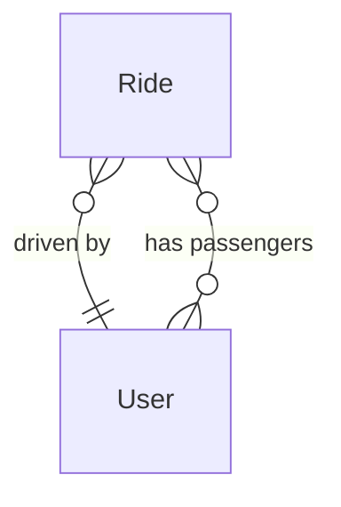

# Domain model

## Entities

### User

Represents a person that participates in carpooling through commute groups

Properties:

- First name
- Last name

Behaviour:

- ?

### Ride

Represents a one-time carpooling ride.

Properties:

- Route
  - From `LatLng`
  - To `LatLng`
- Driver `User`
- Time of departure `DateTime`
- Max passengers `Integer`
- Passengers `[]`
  - Passenger `User`
  - JoinedAt `Timestamp`

Behaviour:

- Add/Remove passenger

## Relationship diagram

