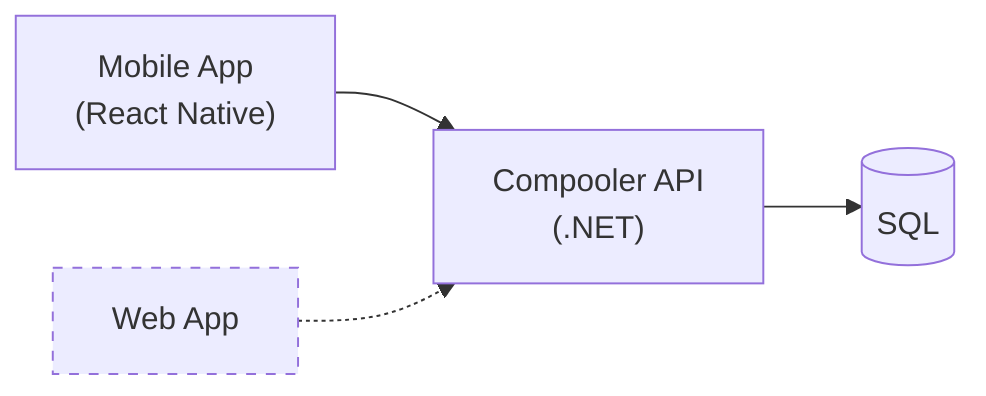

# Initial draft

## Quick pitch

- An application that allows you to find people with similar commute routes as you
  and carpool with them
- Users that commute using a car can post their route (create a "commute group")
  and other users (with similar starting point) can join that route.
- Main goal: help people _connect_ with other people to form car pool groups for their
  commutes
- Side goal: help people _facilitate_ commute carpooling rides

### Pros

- For drivers, economic benefit - split on fuel cost
- For passengers - more transportation options
- Ecological perspective - carpooling is encouraged, less cars

### Cons

- Hard to ensure user safety
- Hard to monetize?

## Important points

- Safety
- Good commute route matching algorithm

## Actors

- Passengers - users that are looking to join someone for their commute
- Drivers - users that are looking for other users to join them in their commute

## Functional requirements

- Create commute groups
- Find commute groups matching a user's preference
- Communication between commute group members about upcoming rides for a commute group
- Live rides (information about a currently happening ride)

## Initial technical architecture

