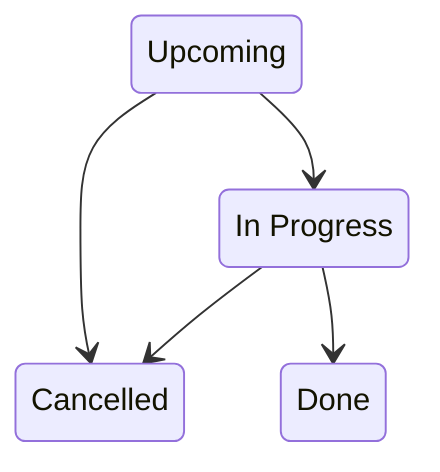
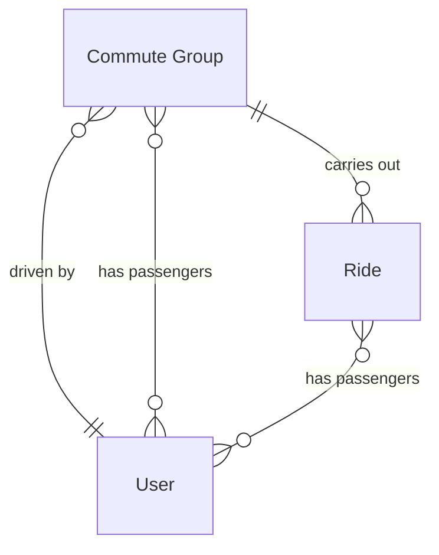

# Domain model

## Entities

### Commute group

Represents a group of people carpooling to a destination on a reocurring basis. Acts as a blueprint for carrying out Rides.

Properties:

- Route
  - From `LatLng`
  - To `LatLng`
- Weekly schedule
  - Days `Day of week union`
  - Leave time `Time`
- Driver `User`
- Passengers `User[]`
- MaxPassengers `Integer`

Behaviour:

- Add passenger
- Remove passenger

### User

Represents a person that participates in carpooling through commute groups

Properties:

- First name
- Last name

Behaviour:

- ?

### Ride

Represents a specific carpooling ride carried out by a commute group.

Properties:

- Status `Upcoming | In Progress | Done | Cancelled`
- Estimated start `DateTime`
- Passengers `[]`
  - Status `Participate | Skip`
  - Passenger `User`
- Group `Group`
- Rides `Ride[]`

Behaviour:

- Change status according to the following state diagram:

- Change passenger's participation status

## Relationship diagram

