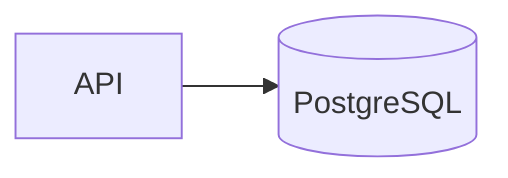

# Overview

The back end currently consists of a single [.NET](https://dotnet.microsoft.com/en-us/) API. The API implements a DDD-like architecture and interaction with it happens through [GraphQL](https://graphql.org/).

Source code is at [`/src/api`](https://github.com/BenasB/compooler/tree/main/src/api).

## Diagram

## API structure

#### Compooler.Domain

Contains core business logic. The domain model is expressed there as POCOs. Contains no details about persistence, presentation, etc. Entities are grouped into transaction boundaries (similarly to Aggregates in DDD).

#### Compooler.Application

Orchestrates the API's work aroud domain, e.g. pulls domain entities, calls behaviour.

#### Compooler.Persistence

Implements the persistence layer using [EF Core](https://learn.microsoft.com/en-us/ef/core/). Responsible for mapping the entities from the domain layer to the database.

#### Compooler.API

Implements the presentation layer by providing a GraphQL interface using [Hot Chocolate](https://chillicream.com/docs/hotchocolate/). The GraphQL schema snapshot can be seen [here](https://github.com/BenasB/compooler/blob/main/src/api/Compooler.API.Tests/__snapshots__/SchemaTests.SchemaChanged.graphql).

#### Test projects

Several projects for testing the related parts of the API.
